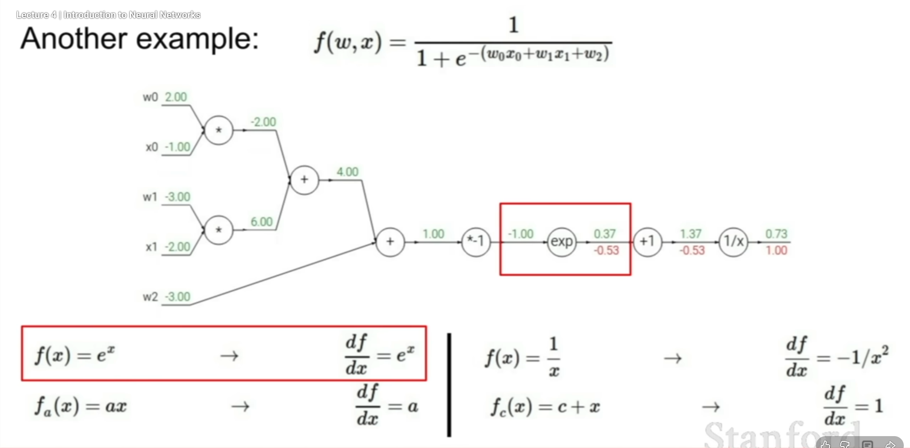
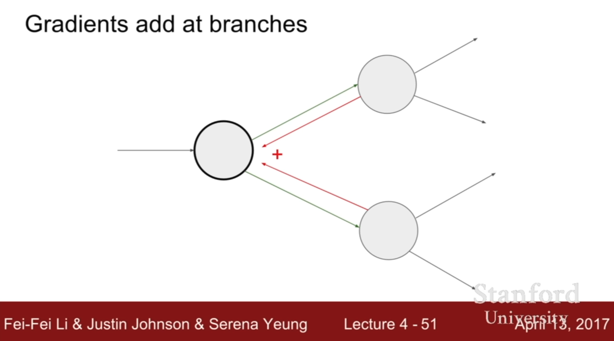
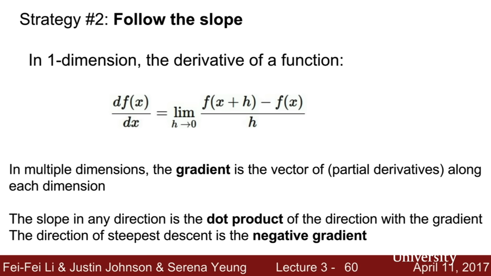

# Introduction-to-Neural-Networks---Stanford
These are the notes for Serena Young's Lecture : https://www.youtube.com/watch?v=d14TUNcbn1k

Handouts:
https://cs231n.stanford.edu/slides/2025/

Latest video: (2025) - but teaching of  https://www.youtube.com/watch?v=2fq9wYslV0A&list=PLoROMvodv4rOmsNzYBMe0gJY2XS8AQg16&index=1

9:31 
Question: What does find the effect of y on f mean?
Answer: That is just translated to df/dy
Additional notes: What she said on 9:57, if you change y a little bit, q will change a little bit just means that if you change dy, the overall df/dy will also change since you changed its denominator dy.
This also appeared in 10:15

19:41
Question: Why is the value of the gradient 1? (Referring to first red number from the right, in back propagation)
Answer: df/df = 1

21:46 
Question: Why -0.53 and not 1? : Referring to the 2nd -0.53 from the right

Answer:
The local gradient is indeed 1, however, the red number represesnts the global gradient (hoe much the final output changes)

To find this, you must multiple the upstream gradient (coming from the right which is the 1st -0.53) by the local gradient (1). You multiply based on the logic of "compounding" the change from the first onto the next.

23:18:
Question: How did she get f_a((x) = ax?
Answer: She mentioned that "a" is just a constant she used that would represent -1,
ax is basically just:

-1 * what ever you answer you came up with the previous nodes;

wherein the "what ever you came up with the previous nodes" is -w0x0+w1x1+w2. 

21:48
Question: Why is the local gradient 1? in [1]x[0.2]=0.2
what did she mean in 23:53 that if we have an addition node the gradient with respect to each of the inputs to the addition is just going to be "one"

Answer: Refer back to q = x + y in 10:18. you want to know the effect of x on q, you need to solve for dq/dx, and so on. 

24:49
Question: How did they get 2 and -1 as local gradients?
Answer: Refer again to 10:18 and look at the multiplication part f = qz

31:06
Such a beauty.

33:16
Question: How does the max node work?
Answer: Only the value that has affected "or won" ove got passed down the rest of the computational graph, since it is the only one that affected change, it only makes sense when we're passing our gradients back we just want to adjust who "won" (hence the max)

??:??
Question: Why would it be linear when you use 1 layer only?
Answer: Technically, two layers won't necessarily make it linear. since wx is the first layer, recall it has a form similar to y = mx + b (equation of a line), if you add a second layer that multiplies wx to w_2(max x,0), the max x makes it non linenar

### Introduction

In order to create a neural network, you have select a formula of choice. Usually you call this your neural network architecture or hypthesis.

Each node would then be solved by breaking down your "main formula" into smaller pieces called "node operations"

For example - If your formula of choice is (x+y)z. This means that you are creating a neural network under this (x+y)z architecture. 

This would then be broken down into nodes that would compose of the basic operations as if there are steps

Node Operation for Node 1: $x+y$

Node Operation for Node 2 : (whatever the output of Node 1 is) $* z$

The result from the **Node Operation** is what you call a **Forward Pass Value**. In the video, these are the green numbers above the links from one node to another. These neural links are what you call **Edges**. 

The whole neural network is just a *computational graph* of your formula of choice. 

We use the formulas for these node operations in order to determine how much change we must adjust our initial values.

### Gates

#### 1. The Addition Gate (Addition Node)
* **Node Operation:** $f(x, y) = x + y$
    - Add x and add y together, you get the value for for the forward pass
* **Local Gradient Computation**: 
    - For the Edge of x
        - $df/dx = 1 + 0$
    - For the Edge of y
        - $df/dy = 0 + 1$
* **Global Gradient Computation**: 
    - Global Gradient = Local Gradient * Upstream Gradient 
    - Resultant Grobal Gradient For the Edge of x
        - $ [df/dx] × UpstreamGradient$
    - Resultant Global Gradient For the Edge of y
        - $ [df/dy] × UpstreamGradient$

* Reflection: This is why the Add Gate is called a Gradient Distributor since it just copies whatever the Upstream Gradient is and passes it (or "distributes it") back to the nodes it came from

#### 2. The Max Gate
**Node Operation:** `max(x, y)`

| Condition | Value |
|---:|:---|
| `x ≥ y` | `x` |
| `y > x` | `y` |

* **Local Gradient Computation**: 
    - If x is max
        - Node Operation = x
        - $df/dx = 1$
        - $df/dy = 0$
    - If y ix max
        - Node Operation = y
        - $df/dx = 0$
        - $df/dy = 1$

* **Global Gradient Computation**: 
    - Global Gradient = Local Gradient * Upstream Gradient 
    - If x is max
        - Global Gradient for x 
            - $ [df/dx] × UpstreamGradient = 1$ 
        - Global Gradient for y
            - $ [df/dy] × UpstreamGradient = 0$ 
    - If y is max
        - Global Gradient for x 
            - $ [df/dx] × UpstreamGradient = 0$ 
        - Global Gradient for y
            - $ [df/dy] × UpstreamGradient = 1$ 

* Reflection:
    - Think of the Max Gate as a traffic director. Because only the largest input "won" and determined the output, the gate "routes" the entire gradient back to that winner. The other inputs (the losers) didn't affect the result, so the gate blocks the flow to them completely by multiplying their gradient by 0.

#### 3. The Multiplication Gate
**Node Operation:** `f(x, y) = x * y`

* **Local Gradient Computation**: 
    - Gradient with respect to x
        - Treat `y` as a constant (coefficient)
        - $df/dx = y$
    - Gradient with respect to y
        - Treat `x` as a constant (coefficient)
        - $df/dy = x$

* **Global Gradient Computation**: 
    - Global Gradient = Local Gradient * Upstream Gradient 
    - Global Gradient for x 
        - $ [df/dx] \times \text{UpstreamGradient} = y \times \text{UpstreamGradient}$ 
    - Global Gradient for y
        - $ [df/dy] \times \text{UpstreamGradient} = x \times \text{UpstreamGradient}$ 

* **Reflection**:
    - This is called a **Gradient Switcher** because the local gradient for one input is literally the value of the *other* input. When the gradient flows back to $x$, it gets scaled by $y$. When it flows back to $y$, it gets scaled by $x$. The gate effectively "switches" the values to determine the strength of the gradient for the opposite wire.

## Gradient Accumulation
If one node is connected to multiple nodes, the gradients add up at this node

## Lecture 4: Convolutional Neural Networks

1:05:25
Question: When do you know you've done enough classifiction
Her Answer: You just try and see, tweak your design choices and see what works best for your product

## Lecture 3: Loss Function and Optimization

### Question: 
 (54:25) What is the gradient again? I don't understand any of this 

#### Answer:

Let's recall, the **gradient** of a function is a **vector** that combines all of its partial derivatives.  
It is denoted by the upside-down triangle symbol **∇** (called *del*).

#### Key Points

- The gradient is a **vector of partial derivatives**.  
  
  The gradient of a function \( f(x, y) \) is: 

  $\nabla f = \left[ \frac{\partial f}{\partial x},\ \frac{\partial f}{\partial y} \right]$

- It **points in the direction of the maximum rate of change** of the function.

- The **magnitude of the gradient** equals the **maximum rate of change** itself.

####  Example

For a function \( f(x, y, z) \), its gradient is the vector:

$\nabla f = \left[ \frac{\partial f}{\partial x},\ \frac{\partial f}{\partial y},\ \frac{\partial f}{\partial z} \right]$

### Follow Up question:
How does that relate to slope? Why do they want us to follow the slope?

#### Answer

It fundamentally changes how we calculate change.
Recall that the basic definition of slope is sensitivity: How much does the output change relative to a change in input?

$$\text{Slope} \approx \frac{\text{Change in Output}}{\text{Change in Input}}$$

The number of input dimensions determines how many "directions" of slope exist.

1. One Dimension (1 Input): The Single Slope
In a 1D function like $f(x)$, you only have one input variable. You can only move forward or backward along that line.

    - Because there is only one direction of travel, **there is only one slope at any given point.**
    - We calculate this using the ordinary derivative $\frac{dy}{dx}$ (Rise over Run).

2. Two Dimensions (2 Inputs): Infinite Slopes In a multivariable function like $f(x, y)$, you are standing on a surface (like a hill).
    - Because you have 2 input dimensions ($x$ and $y$), you can move in many directions (North, East, South-West, etc.).
    - Therefore, a single number (like "3") is no longer enough to describe the slope, because the slope depends on which direction you walk.

3. The Solution: Partial Derivatives & The GradientTo handle this, we measure the slope in the direction of each axis separately:
    - Partial Derivative w.r.t $x$: Slope if you only move along the x-axis.
    - Partial Derivative w.r.t $y$: Slope if you only move along the y-axis.When we package these separate slopes together, we get a vector called the Gradient ($\nabla f$). The gradient doesn't just tell you how steep the hill is; it tells you the direction of the steepest ascent.

You can use this as a visual reference if you have troubles in understanding gradients:
- https://www.youtube.com/watch?v=GkB4vW16QHI : Quick

Why the dot product then?
- https://www.youtube.com/watch?v=snIdXOjUG44 : Gradients Review in Multivariable Calculus

#### Why negative gradient?
- Because a gradient is the max increase in change, a negative gradient is the max decrease in change. Since in neural networks, gradients are used to signify loss (error), we want the least loss (hence the negative gradient)

- https://www.youtube.com/watch?v=IHZwWFHWa-w : Extensive by 3Blue1Brown

Gradient Descent Visualization:
- http://vision.stanford.edu/teaching/cs231n-demos/linear-classify/

**Dimensions** of a function is determined by how many **independent inputs** it takes not the axes. - That's why it's called multi variable (inputs) calculus

